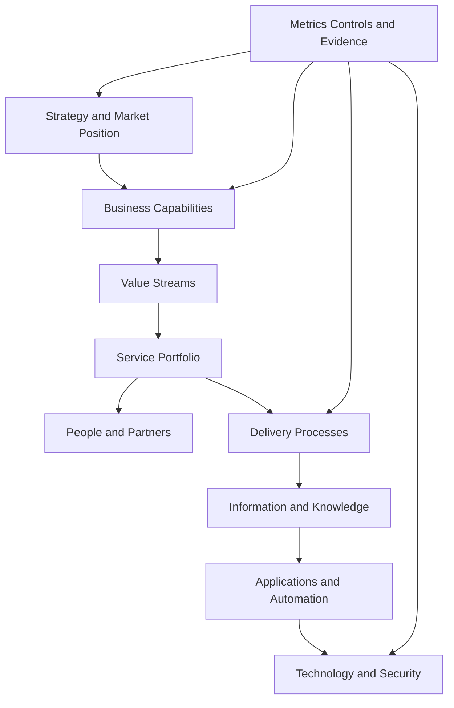

# Company Architecture Overview

## Architecture objective

Design the company as a coherent system in which strategy, services, people, processes, information, applications, technology, security, partners, and metrics reinforce one another.

## Architectural principles

- Business outcome before tool
- Security and maintainability by design
- Microsoft specialization without ecosystem lock-in
- One canonical source for important information
- Reuse before reinvention
- Human accountability for automated work
- Standardize the common case; document exceptions
- Partner where independence or specialist depth is required
- Evidence over unsupported claims
- Keep the launch architecture minimal but extensible
