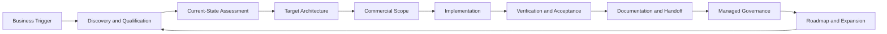

# Solution and Delivery Architecture

## Purpose

Define how `[COMPANY_NAME]` converts business needs into secure, maintainable, supportable technology outcomes across advisory, implementation, automation, and recurring governance services.

This is the reference architecture for solution design and delivery. Product-specific playbooks may specialize it but must not weaken its controls without an approved exception.

## 1. Architecture objective

Every delivered solution should connect five layers:

1. Business outcome
2. Process and operating ownership
3. Information and integration
4. Application and platform capabilities
5. Security, evidence, and lifecycle management

A technical configuration is not a complete solution until ownership, operation, evidence, and change management are defined.

## 2. Design principles

- Business outcome before tool
- Strategy before implementation
- Microsoft specialization without unnecessary ecosystem lock-in
- Identity is the primary control plane
- Least privilege and named accountability
- Standardize the common case; price and document exceptions
- Secure defaults with explicit risk acceptance
- Automation must have human ownership
- Documentation is a delivery artifact, not an afterthought
- Evidence must be captured as work occurs
- Customer environments must remain separated
- Reuse proven patterns before creating custom designs
- Managed services begin only after a supportable baseline exists
- Regulated or credentialed work remains with qualified independent parties

## 3. Standard value stream

## 4. Discovery and qualification architecture

Discovery must establish:

- Business objective and trigger
- Executive sponsor
- Users, locations, entities, and operating constraints
- Existing providers and internal owners
- Current platforms, licensing, devices, data, applications, and integrations
- Security, insurance, contractual, and compliance requirements
- Known incidents, unresolved risks, and inherited technical debt
- Required timeline
- Decision process and budget reality
- Customer responsibilities and access readiness

Qualification should reject or defer engagements where:

- No authorized sponsor exists
- Required access cannot be provided
- The customer refuses reasonable security or documentation requirements
- Scope cannot be bounded and the customer refuses a paid assessment
- The expected support burden exceeds company capacity
- Legal, regulatory, or ethical conflicts cannot be resolved

## 5. Target architecture domains

### 5.1 Identity and privileged access

Standard direction:

- Entra ID as the primary identity control plane for Microsoft-centric customers
- MFA for all users, with stronger methods prioritized for privileged and high-risk users
- Conditional Access based on identity, device, application, risk, and location context
- Separate administrative identities where appropriate
- Least-privileged role assignment
- Privileged Identity Management or equivalent just-in-time controls where licensing and risk justify it
- Emergency-access accounts with documented controls
- Joiner, mover, and leaver procedures
- Guest and external-user governance
- Periodic access review

### 5.2 Endpoint and device trust

Standard direction:

- Intune or an approved endpoint-management platform
- Defined supported-device and operating-system standards
- Enrollment and ownership classification
- Compliance policies
- Security baselines
- Endpoint protection and detection
- Disk encryption
- Update rings and patch ownership
- Local-administrator control
- Application deployment and removal
- Device retirement and evidence

### 5.3 Messaging, collaboration, and information sharing

Standard direction:

- Exchange Online, Teams, SharePoint, and OneDrive governance
- Defined team, site, group, and mailbox ownership
- External sharing standards
- Guest lifecycle
- Naming and provisioning standards where useful
- Data-location and authority decisions
- Retention and deletion aligned with business and legal requirements
- Secure client and partner exchange patterns
- Recovery and backup expectations documented

### 5.4 Security operations

Standard direction:

- Defender capabilities appropriate to license and risk
- Email and collaboration protection
- Endpoint detection and response
- Identity and cloud-app visibility where justified
- Secure Score used as a diagnostic and prioritization input, not an end in itself
- Logging and alert ownership
- Incident contacts and escalation
- Evidence retention
- Exception and risk records
- Scaled monitoring through Microsoft, partner, or customer capabilities

Sentinel or another SIEM should be introduced only when the customer’s risk, data sources, response capability, and economics support it.

### 5.5 Data governance and compliance readiness

Standard direction:

- Information ownership
- Data classification where useful and supportable
- Retention and deletion requirements
- Sharing and access controls
- Evidence mapping
- Policy and procedure documentation
- Control owners
- Remediation plans
- Periodic review

The company may perform readiness, control design, evidence organization, technical remediation, and continuing control maintenance. Independent qualified firms perform formal examinations, attestations, legal opinions, or other credentialed work.

### 5.6 Virtual workspace

Standard direction:

- Azure Virtual Desktop or Windows 365 selected according to application, identity, networking, performance, management, and cost requirements
- Named access and Conditional Access
- Hardened images
- Profile and storage architecture
- Application packaging and lifecycle
- Private connectivity where needed
- Monitoring, patching, backup, and recovery ownership
- Capacity and cost management
- Operational runbooks

### 5.7 Business applications and integration

The company should treat the full customer operating environment as a connected system.

Common application domains:

- CRM
- Professional-services and project systems
- IT service management
- Accounting, billing, collections, and finance
- HR and workforce systems
- Communications and contact center
- Industry-specific platforms
- Document management
- Analytics and reporting
- Legacy desktop and line-of-business applications

Integration methods, in preferred order when practical:

1. Supported native capability
2. Vendor-supported connector
3. API or webhook
4. Microsoft Power Platform or Logic Apps
5. Scripted automation using supported interfaces
6. Lightweight application
7. Robotic or desktop automation when no reliable interface exists

Every integration must define:

- System of record
- Source and target objects
- Trigger and frequency
- Identity and permissions
- Data classification
- Error handling
- Duplicate and idempotency behavior
- Monitoring and alert ownership
- Retry and recovery
- Change dependencies
- Documentation
- Support and retirement plan

## 6. Automation architecture

Automation is appropriate when it improves business outcomes without creating unowned technical debt.

Automation standards:

- Use service principals, managed identities, or named service accounts rather than personal credentials
- Store secrets in an approved secret-management system
- Use least privilege
- Separate development, testing, and production where material
- Log meaningful execution and failure events
- Define a human owner and escalation path
- Document dependencies and expected inputs/outputs
- Include rollback or manual-continuity procedures
- Version scripts and configuration in source control
- Review high-risk automations before production
- Measure business benefit and maintenance burden

## 7. Multi-customer management architecture

The company must maintain strong separation among customer environments.

Required controls:

- Named customer access
- Least-privileged delegated administration
- Azure Lighthouse, Microsoft delegated administration, or equivalent approved mechanisms where appropriate
- Separate customer documentation and secrets
- Prohibition on shared generic administrator credentials unless technically unavoidable and explicitly controlled
- Logged and reviewable privileged activity
- Access expiration and offboarding
- Customer-specific exception records
- Clear boundary between company systems and customer systems
- No customer data copied into unapproved tools

## 8. Standard delivery stages

### Stage 1 — Intake

Outputs:

- Qualified opportunity
- Sponsor and stakeholders
- Initial problem statement
- Decision on assessment versus direct scope

### Stage 2 — Assessment

Outputs:

- Current-state inventory
- Risks and gaps
- Dependencies
- Assumptions and unknowns
- Preliminary target state

### Stage 3 — Architecture and scope

Outputs:

- Target architecture
- Standard pattern and exceptions
- Scope and exclusions
- Customer responsibilities
- Partner responsibilities
- Estimate and pricing logic
- Acceptance criteria
- Risk and change-control approach

### Stage 4 — Preparation

Outputs:

- Approved access
- Backup or recovery plan
- Change window
- Communications plan
- Pilot group
- Implementation checklist

### Stage 5 — Implementation

Requirements:

- Approved runbook or work plan
- Evidence captured during execution
- Deviations escalated
- Changes traceable to scope
- Customer decisions recorded

### Stage 6 — Verification

Outputs:

- Test results
- Configuration evidence
- Issue and exception list
- Remediation or risk acceptance
- Customer acceptance

### Stage 7 — Handoff

Outputs:

- Architecture and configuration record
- Administrative ownership
- Operating runbooks
- User lifecycle procedure
- Support and escalation model
- Open-risk register
- License and renewal ownership
- Roadmap

### Stage 8 — Managed governance

Outputs:

- Recurring review cadence
- Change and exception management
- Security and configuration review
- Documentation maintenance
- Roadmap progress
- Partner coordination
- Expansion opportunities

## 9. Documentation architecture

Each customer engagement should create or update:

- Customer profile and business context
- Stakeholder and ownership map
- Environment inventory
- Architecture diagram
- Configuration baseline
- Access and administrative model
- Data and integration map
- Runbooks
- Testing and acceptance evidence
- Risk and exception register
- Decision log
- Change record
- Roadmap
- Closeout and lessons learned

Documentation must identify the authoritative system for each information type.

## 10. Evidence and acceptance

Evidence may include:

- Exported configuration
- Screenshots where exports are impractical
- Policy and assignment records
- Device and user inventories
- Test results
- Logs
- Customer approvals
- Signed acceptance
- Risk acceptance
- Partner deliverables

Evidence should be sufficient to demonstrate that the agreed outcome was delivered and to support future operation, audit readiness, troubleshooting, and change management.

## 11. Security exception process

Any material deviation from the approved standard must record:

- Requested deviation
- Business reason
- Affected systems and data
- Threat or risk created
- Compensating controls
- Responsible owner
- Expiration or review date
- Approver
- Remediation plan where applicable

Exceptions must not become undocumented permanent configuration.

## 12. Partner delivery boundary

Partners may provide specialist depth, regulated work, geographic coverage, hardware, field services, or supplemental capacity.

The company must define:

- Customer-facing responsibility
- Contracting party
- Scope and deliverables
- Access and data handling
- Security requirements
- Evidence and acceptance
- Escalation
- Liability and insurance
- Knowledge transfer
- Transition and termination

The company should not imply independence when it performs readiness or remediation work that will later be reviewed by an independent auditor or assessor.

## 13. Supportability gate

Before a customer enters recurring service, confirm:

- Administrative access is named and controlled
- Supported licenses are present
- Devices and identities are sufficiently inventoried
- Material unsupported systems are documented
- Open critical risks are remediated or accepted
- Documentation meets the minimum standard
- Backup and recovery ownership is clear
- Customer contacts and escalation are defined
- Service inclusions and exclusions are understood
- Monitoring and alert ownership is established
- Expected service load fits capacity and price

## 14. Architecture review triggers

Senior architecture or security review is required for:

- Privileged-access changes
- Identity-provider migration
- Tenant-to-tenant migration
- Material data migration
- New external sharing model
- New production integration
- New automation with privileged or financial impact
- Virtual-workspace architecture
- Security-control exception
- Regulated or high-sensitivity data
- Cross-customer tooling or access pattern
- Nonstandard support commitment

## 15. Definition of done

A solution is complete only when:

- The business outcome is demonstrably met
- The implementation is tested
- Ownership is assigned
- Documentation is complete
- Evidence is stored
- Risks and exceptions are recorded
- Customer acceptance is obtained
- Support and lifecycle responsibilities are clear
- Reusable lessons and patterns are captured
