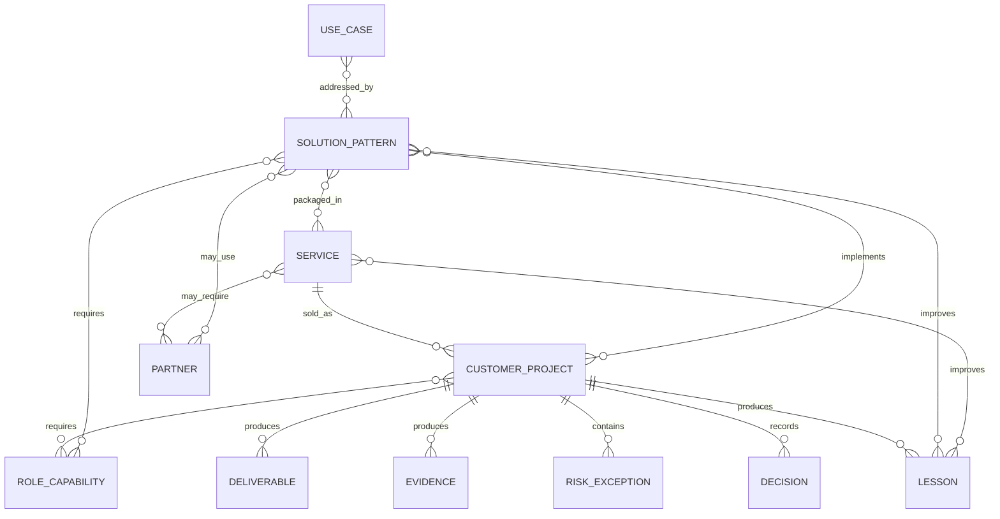

# Knowledge and Automation Architecture

## Purpose

Define how `[COMPANY_NAME]` converts individual experience into structured, reusable business knowledge that improves discovery, solution design, delivery, staffing, proposals, governance, and automation.

The repository is the launch implementation. A dedicated business application such as Dataverse may be introduced later after real operating usage validates the model.

## 1. Architecture objective

The knowledge system should answer practical operating questions:

- What business problem is the customer experiencing?
- Which solution patterns and services fit that situation?
- What evidence supports the recommendation?
- Which skills, roles, partners, and prerequisites are required?
- What was delivered previously, with what outcome and effort?
- What risks, exceptions, and maintenance obligations exist?
- What reusable assets can accelerate the next engagement?

## 2. Core information objects

### 2.1 Use case

A use case represents a specific business situation or operational need.

Required metadata:

- Unique identifier
- Name
- Business domain
- Customer condition or trigger
- Actor or stakeholder
- Current process
- Pain or risk
- Desired outcome
- Frequency and volume
- Systems involved
- Data involved
- Security or compliance implications
- Estimated business impact
- Time sensitivity
- Known constraints
- Candidate solution patterns
- Discovery questions
- Evidence or examples
- Status and owner

A use case should be concrete enough to support discovery and solution matching. “Improve efficiency” is not a sufficient use case; “automatically create a project and billing schedule when a signed opportunity reaches Closed Won” is.

### 2.2 Solution pattern

A reusable technical and operating design that addresses one or more use cases.

Required metadata:

- Unique identifier
- Name and summary
- Applicable use cases
- Business outcome
- Architecture pattern
- Systems and interfaces
- Identity and access model
- Data flow
- Dependencies and prerequisites
- Risks and limitations
- Implementation stages
- Testing and acceptance
- Monitoring and support
- Estimated effort range
- Maintenance burden
- Required skills
- Applicable partners
- Reusable code, templates, or runbooks
- Reference projects and evidence
- Version and lifecycle status

### 2.3 Service

A commercial offer or statement-of-work pattern that packages one or more solution patterns and delivery activities.

Required metadata:

- Ideal customer
- Trigger event
- Outcomes
- Scope
- Exclusions
- Assumptions
- Customer responsibilities
- Delivery stages
- Required roles and partners
- Evidence and acceptance
- Pricing logic
- Cost and capacity model
- Recurring attach
- Expansion path
- Metrics
- Revision history

### 2.4 Customer project

A specific engagement with commercial, delivery, evidence, and outcome records.

Required metadata:

- Customer and sponsor
- Business context
- Related use cases
- Services and solution patterns used
- Scope and agreement
- Roles and contributors
- Partners
- Plan and milestones
- Decisions and changes
- Risks and exceptions
- Deliverables and evidence
- Actual hours and costs
- Acceptance
- Outcomes
- Lessons learned
- Reusable assets created
- Follow-on roadmap

### 2.5 Skill and role capability

Represents the capability required to sell, design, deliver, review, or operate a service.

Required metadata:

- Capability name
- Role category
- Proficiency level
- Evidence or qualification
- Services and patterns supported
- Availability or sourcing method
- Security/access constraints
- Review or supervision requirements

The model should not assume any historical named person remains involved.

### 2.6 Partner

Required metadata:

- Organization
- Partner category
- Services and capabilities
- Geographic and industry coverage
- Credentials
- Commercial model
- Customer ownership
- Contracting model
- Security and data handling
- Insurance and liability
- Escalation
- Independence requirements
- Qualification status
- Review date
- Related services and solution patterns

### 2.7 Deliverable and evidence

Required metadata:

- Type
- Project and service relationship
- Owner
- Customer visibility
- Sensitivity and classification
- Acceptance status
- Storage location
- Retention requirement
- Version
- Reuse eligibility

### 2.8 Risk, assumption, decision, and exception

These should be separate but related record types.

Every material record should identify:

- Context
- Owner
- Date
- Impact
- Required action
- Status
- Approval
- Review or expiration date
- Related customer, project, service, or solution

### 2.9 Lesson learned

Required metadata:

- Situation
- Expected result
- Actual result
- Root cause
- Recommendation
- Affected service, pattern, template, or standard
- Action owner
- Completion status

## 3. Relationship model

## 4. Top 200 solution-opportunity catalog

The Top 200 catalog is not merely a list of technologies. It is a ranked library of recognizable business situations that can support prospecting, discovery, solution matching, proposal acceleration, and productization.

Each opportunity should include:

- Specific business situation
- Likely buyer
- Trigger event
- Observable symptoms
- Business impact
- Current manual or fragmented process
- Candidate systems
- Candidate solution pattern
- Expected implementation effort
- Delivery risk
- Maintenance burden
- Security and compliance impact
- Reusability
- Recurring-service potential
- Discovery questions
- Example message or outreach angle

### Ranking model

Use a weighted score based on:

- Business impact
- Frequency in the target market
- Buyer urgency
- Ease of identifying the opportunity
- Time to value
- Delivery effort
- Delivery risk
- Maintainability
- Support burden
- Reusability
- Strategic fit
- Recurring revenue potential

A simple initial priority formula may use:

> Priority = (Impact × Frequency × Urgency × Strategic Fit × Reusability) ÷ (Effort × Risk × Maintenance Burden)

Weights should be revised using actual sales and delivery evidence.

## 5. Repository-first implementation

### Canonical launch locations

- Business and service standards: `docs/`
- Historical and synthesized context: `knowledge/`
- Reusable templates: `templates/`
- Structured launch tasks: `ops/`
- Agent instructions and reusable workflows: `.agents/skills/`
- Code and automation: version-controlled source directories
- Decisions: `docs/decisions/`

### Repository standards

- Stable identifiers for reusable records
- Frontmatter or structured data for machine-readable metadata where valuable
- Relative links among related records
- Status values with defined meanings
- Clear distinction among proposed, approved, active, retired, and historical content
- No customer secrets or unapproved sensitive data in the repository
- Review history and ownership
- Automated validation for required fields and broken links

## 6. Future Dataverse or application model

A future system may use tables corresponding to the core objects above.

Potential Dataverse tables:

- Use Cases
- Solution Patterns
- Services
- Customers
- Opportunities
- Projects
- Project Deliverables
- Evidence Items
- Skills
- Role Capabilities
- Contributors
- Partners
- Risks
- Assumptions
- Decisions
- Exceptions
- Lessons Learned
- Reusable Assets

Potential benefits:

- Structured search and filtering
- Relationship-driven discovery
- Proposal generation
- Resource and skill matching
- Project and evidence linkage
- Metrics and reporting
- Workflow automation
- Security roles and customer separation

Do not build this application before the repository model is used enough to identify stable fields, relationships, and workflows.

## 7. Automation use cases for the knowledge system

Potential automations include:

- Suggest solution patterns from discovery notes
- Identify missing discovery fields
- Generate a draft service brief or SOW from approved patterns
- Recommend required roles and partner categories
- Create project checklists from the sold service
- Validate documentation completeness
- Link evidence to acceptance requirements
- Produce closeout and lessons-learned prompts
- Update solution patterns from approved lessons
- Generate case-study drafts from approved customer evidence
- Surface expansion opportunities during governance reviews
- Flag stale partner qualifications, exceptions, or service documents

## 8. AI and agent controls

AI may assist with synthesis, matching, drafting, and validation, but human accountability remains required.

Controls:

- Use only approved data sources
- Respect customer confidentiality and separation
- Do not expose secrets or privileged customer data
- Distinguish generated hypotheses from approved facts
- Require human review for architecture, security, pricing, contracts, and customer commitments
- Preserve source links and evidence
- Record material decisions outside transient chat
- Validate generated artifacts against canonical standards

## 9. Lifecycle governance

Every reusable object should have:

- Owner
- Status
- Version
- Last review date
- Next review date where appropriate
- Source and evidence
- Related decisions
- Retirement or replacement path

Suggested statuses:

- Proposed
- In review
- Approved
- Active
- Deprecated
- Retired
- Historical

## 10. Metrics

Track:

- Number of approved use cases and solution patterns
- Reuse rate
- Time from discovery to proposal
- Proposal win rate by pattern
- Estimated versus actual effort
- Gross margin by service and pattern
- Rework and support burden
- Number of lessons incorporated
- Documentation completeness
- Search and recommendation usefulness
- Expansion revenue attributable to cataloged opportunities

## 11. Minimum launch implementation

Before the first pilot, the repository should contain:

- Ideal-customer profile
- Discovery guide
- Secure Workplace Foundation service definition
- At least 20 high-confidence solution opportunities
- Core architecture and security standards
- Partner qualification template
- Project, risk, decision, evidence, and closeout templates
- A method for recording actual effort and lessons

The catalog should expand toward 200 opportunities based on deliberate research and real engagement evidence rather than filler.
