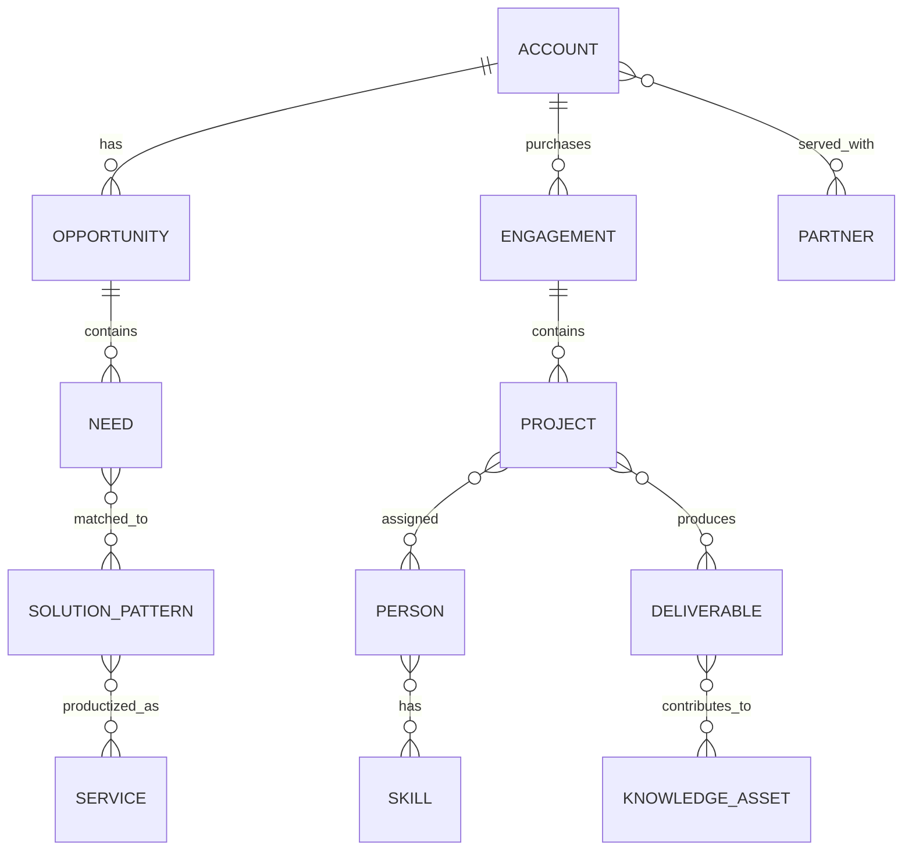

# Information Architecture

## Core business objects

### Organization and relationship

- Account
- Contact
- Prospect
- Customer
- Partner
- Vendor
- Distributor

### Commercial

- Opportunity
- Discovery
- Need
- Solution option
- Estimate
- Proposal
- Contract
- Renewal

### Delivery

- Engagement
- Project
- Workstream
- Task
- Change
- Risk
- Issue
- Decision
- Deliverable
- Acceptance
- Runbook

### Service management

- Service
- Service package
- Customer subscription
- Request
- Incident
- Problem
- Configuration item
- Exception
- Service review

### Knowledge

- Use case
- Solution pattern
- Architecture pattern
- Automation
- Standard
- Policy
- Template
- Skill
- Lesson
- Case study

### People and capability

- Person
- Role
- Skill
- Availability
- Certification
- Assignment

### Finance

- Product
- Price
- Cost
- Invoice
- Payment
- Subscription
- License
- Margin

## Foundational relationships

## Governance

For each object define:

- System of record
- Owner
- Data classification
- Required fields
- Retention
- Access
- Quality rules
- Integration paths
- Audit requirements

The exact application platform remains open.
