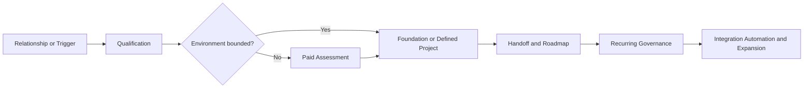

# Market and Go-to-Market Plan

## Purpose

Define the target market, qualification model, offer sequence, sales process, messaging, channel strategy, and evidence program for `[COMPANY_NAME]`.

## 1. Market position

`[COMPANY_NAME]` serves organizations that depend on technology but lack the senior internal capacity to govern it coherently.

The company is positioned as:

- A fractional technology leadership capability
- A secure Microsoft workplace and governance partner
- An architecture, implementation, and remediation team
- An integration and automation partner
- A security and compliance-readiness partner
- A coordinator of qualified specialists and independent professionals

The company is not positioned primarily as:

- A commodity help desk
- A break/fix provider
- A staffing company
- A license-discount shop
- An unlimited custom-development firm
- An independent audit, legal, tax, or attestation firm

## 2. Ideal customer profile

### Core range

- Approximately 10–150 employees
- Broader practical range of approximately 1–200 users
- Microsoft 365-centric or willing to standardize on Microsoft for identity, workplace, collaboration, endpoint, and security foundations

### Strong-fit conditions

- No experienced CIO, CTO, security leader, or cloud architect
- One internal IT generalist or a legacy outsourced provider
- Unclear administrative ownership
- Inconsistent MFA, Conditional Access, endpoint management, or security configuration
- Fragmented Teams, SharePoint, OneDrive, and sharing practices
- Weak documentation
- Manual administrative or financial workflows
- Multiple disconnected business systems
- Insurance, customer, contractual, or compliance pressure
- Acquisition, separation, provider replacement, rapid growth, or incident trigger
- Executive willingness to adopt standards and assign owners

### Likely buyers

- Owner or founder
- President
- Chief operating officer
- Chief financial officer
- IT manager
- Operations leader
- Security or compliance leader

### Disqualifiers or caution indicators

- No authorized sponsor
- Refusal to provide necessary access
- Expectation of unlimited support for a project fee
- Refusal to accept customer responsibilities
- Unwillingness to document risk exceptions
- Unsupported technology environment with no remediation budget
- Active legal, regulatory, or ethical conflict
- Fixed-fee demand for an environment that cannot be bounded
- Support demand that exceeds launch capacity

## 3. Buyer problems and messages

### Executive owner

Problem:

- Technology risk and spending are unclear
- Providers discuss tools rather than business ownership
- No one is accountable for the whole environment

Message:

- Senior technology judgment without building a complete internal department
- Clear roadmap, ownership, standards, and continuing accountability

### Operations leader

Problem:

- Manual handoffs, fragmented tools, rework, and poor visibility

Message:

- Connect systems, standardize operating processes, and automate repeatable work without creating unowned complexity

### Finance leader

Problem:

- License sprawl, uncontrolled access, weak vendor accountability, collections or workflow friction, and unclear technology budget

Message:

- Govern costs, access, vendors, data, and investment sequencing while improving audit and insurance readiness

### IT manager or generalist

Problem:

- Too much operational responsibility and insufficient senior architecture/security capacity

Message:

- Add architecture, standards, escalation, and project capacity without displacing useful internal ownership

### Security or compliance leader

Problem:

- Incomplete controls, weak evidence, and remediation ownership gaps

Message:

- Establish practical technical controls, evidence, remediation, and continuing maintenance while preserving independent attestation

## 4. Entry offers

### 4.1 Technology, Security, and Governance Assessment

Use when uncertainty is material.

Customer outcome:

- Clear current state
- Prioritized risks
- Target architecture
- Roadmap
- Implementation options and estimates

### 4.2 Foundation Core

Primary use:

- Fewer than 10 users
- Essential secure Microsoft operating baseline

Working model:

- 26–32 hours
- $6,000–$9,000

### 4.3 Full Secure Microsoft 365 Foundation

Primary use:

- Generally 10 or more users
- Complete identity, endpoint, security, collaboration, data, logging, documentation, and handoff baseline

Working model:

- 46-hour controlled-environment baseline
- $12,000–$18,000 before complexity adjustments

### 4.4 Fractional Technology Roadmap

Use when the customer needs strategy, investment sequencing, vendor governance, security prioritization, and executive support before implementation.

### 4.5 Integration and Automation Opportunity Assessment

Use when the primary pain is manual work or disconnected business systems.

### 4.6 Virtual Workspace Assessment or Implementation

Use for secure remote access, hosted applications, Azure Virtual Desktop, or Windows 365 needs.

### 4.7 Compliance-Readiness Assessment

Use for control, evidence, policy, and remediation preparation. Formal attestation remains independent.

## 5. Preferred offer sequence

The company should not force an assessment when scope is genuinely controlled, but should not accept fixed-fee uncertainty merely to reduce sales friction.

## 6. Sales process

### Stage 1 — Target

- Identify account and likely trigger
- Identify buyer and relationship path
- Select relevant use case or solution opportunity

### Stage 2 — Qualify

- Confirm customer size and condition
- Confirm sponsor
- Confirm urgency and consequence
- Confirm Microsoft and system context
- Confirm willingness to adopt standards
- Decide assessment versus direct scope

### Stage 3 — Discover

- Business outcomes
- Stakeholders and ownership
- Technology and provider context
- Security and compliance requirements
- Timeline and dependencies
- Budget and decision process

### Stage 4 — Design

- Target outcome
- Architecture direction
- Product or custom engagement
- Assumptions and exclusions
- Customer and partner responsibilities
- Estimate and complexity factors

### Stage 5 — Propose

- Business problem and outcome
- Scope and exclusions
- Delivery stages
- Evidence and acceptance
- Price and payment
- Support and warranty boundary
- Recurring-governance option

### Stage 6 — Close

- Resolve decisions and risk
- Execute agreement
- Collect required initial payment
- Schedule access and kickoff

### Stage 7 — Deliver and expand

- Capture evidence and outcome
- Complete closeout
- Propose governance
- Use roadmap and solution catalog to identify justified expansion

## 7. Initial channels

### Warm professional network

Highest-priority launch channel because it can produce trust, candid feedback, and pilot opportunities.

Sources:

- Former clients
- Former colleagues
- Professional peers
- Business owners
- Technology leaders
- Accountants, attorneys, insurance professionals, and consultants

### LinkedIn and direct outreach

Use specific trigger- or use-case-based messages rather than generic managed-services promotion.

### Referral and partner channels

Priority categories:

- Accounting firms
- Legal firms
- Insurance brokers
- Business consultants
- Software vendors
- Telecom providers
- MSPs and specialists
- Investors and private-equity operating contacts

### Website and content

Launch website should clearly explain:

- Who the company serves
- Which conditions trigger the need
- What the assessment and Foundation offers produce
- How the company differs from a commodity MSP
- How recurring governance works
- How to begin discovery

Content should demonstrate judgment through practical explanations, checklists, risk patterns, and anonymized evidence rather than volume marketing.

## 8. Solution-catalog-led prospecting

The Top 200 catalog should provide precise outreach angles.

Example structure:

- Observable situation
- Buyer
- Consequence
- Discovery question
- Likely solution pattern
- Expected business value

Example message pattern:

> We often find that organizations using Microsoft 365 have MFA enabled but still lack controlled admin access, device trust, and a documented user lifecycle. We assess and establish that complete operating baseline rather than treating MFA as the finish line.

Do not make unsupported claims or use fear-based messaging.

## 9. Sales assets

Minimum launch assets:

- Business overview
- Ideal-customer profile
- Assessment one-pager
- Foundation Core one-pager
- Full Foundation one-pager
- Recurring-governance overview
- Discovery guide
- Qualification checklist
- Complexity-factor worksheet
- Proposal template
- Statement-of-work template
- Partner overview
- Initial solution-opportunity catalog
- Case-study template

## 10. Pilot strategy

The first pilots should optimize for learning and credible evidence, not merely logo acquisition.

Preferred pilot characteristics:

- Strong executive sponsor
- Reasonably controlled environment
- Clear trigger and outcome
- Customer willing to make decisions promptly
- Ability to capture planned-versus-actual effort
- Ability to document an anonymized proof point where appropriate
- Reasonable recurring-governance fit

Pilot discounting, if any, should exchange value explicitly for:

- Timely access and decisions
- Reference or testimonial rights
- Case-study rights
- Structured feedback
- Permission to use anonymized metrics

Discounts must not hide an economically invalid service model.

## 11. Evidence and feedback loop

For every opportunity and engagement capture:

- Source and channel
- Trigger and buyer
- Qualified or disqualified reason
- Offer proposed
- Price and objections
- Win or loss reason
- Sales-cycle duration
- Estimated and actual effort
- Outcome and acceptance
- Project-to-recurring conversion
- Expansion
- Referral or testimonial

Use this evidence to revise:

- Ideal-customer definition
- Qualification
- Scope and prerequisites
- Pricing
- Messaging
- Partner strategy
- Solution catalog ranking

## 12. Metrics

### Pipeline

- Target accounts
- Qualified opportunities
- Pipeline value
- Pipeline by offer and channel
- Coverage against capacity and revenue target

### Conversion

- Qualification rate
- Discovery-to-proposal rate
- Proposal win rate
- Assessment-to-project conversion
- Project-to-recurring conversion

### Economics

- Acquisition effort
- Presales hours
- Average project value
- Average recurring revenue
- Gross margin
- Days sales outstanding

### Customer evidence

- Time to value
- Outcome attainment
- Acceptance exceptions
- Renewal
- Expansion
- Referral and testimonial rate

## 13. Open go-to-market decisions

- Final name and approved messaging
- First vertical focus, if any
- Assessment pricing
- Public versus consultative Foundation pricing
- Minimum recurring-governance fee
- Pilot discount policy
- Geographic scope
- Website and content launch date
- First 20 solution opportunities
- Initial referral and channel partners
