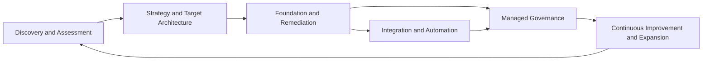

# Service Architecture

## Purpose

Define the connected service portfolio and the rules for converting advisory work into productized implementation, recurring governance, and expansion.

Detailed service scope belongs in `docs/services/`. Commercial logic belongs in `docs/business/10-PRICING-AND-UNIT-ECONOMICS.md`.

## Service portfolio model

The service architecture follows the company operating formula:

> Advisory at the front, standardized implementation in the middle, and recurring governance at the back.

## 1. Discovery and assessment

### Purpose

Bound uncertainty and identify the correct target state before committing to implementation.

### Outcomes

- Business context and sponsor
- Current-state inventory
- Risk and gap analysis
- Ownership and provider map
- Target-state recommendations
- Prioritized roadmap
- Implementation options and estimates

### Use when

- The environment is inherited or poorly documented
- Provider transition is uncertain
- Scope cannot be reliably bounded
- Multiple systems, entities, locations, or stakeholders are involved
- Security, compliance, or incident conditions require deeper evidence

## 2. Fractional technology leadership

### Outcomes

- Clear strategy and investment sequence
- Executive decision support
- Vendor and platform governance
- Risk and security prioritization
- Technology roadmap and budget
- Policy and governance design
- Solution selection and modernization planning

### Commercial forms

- Defined strategy engagement
- Recurring advisory retainer
- Executive or board support
- Technology-roadmap program

## 3. Secure Microsoft 365 Foundation

The primary productized implementation offer.

### Foundation Core

- Primarily fewer than 10 users
- 26–32-hour working delivery model
- $6,000–$9,000 working range
- Essential identity, privileged access, endpoint trust, Defender, email, data authority, incident readiness, documentation, and handoff

### Full Foundation

- Generally 10 or more users or customers requiring the complete baseline
- 46-hour base for a controlled greenfield or cooperative takeover
- $12,000–$18,000 working range before complexity adjustments
- Complete tenant, administration, identity, privileged access, Intune, device compliance, endpoint security, email security, Secure Score, data, retention, application control, logging, documentation, QA, and handoff scope

The earlier $3,500–$7,500 estimate is superseded historical context and must not be used as the current Full Foundation baseline.

See `docs/services/01-SECURE-WORKPLACE-FOUNDATION.md`.

## 4. Cloud and virtual workspace

### Outcomes

- Secure remote access
- Standardized hosted desktops or cloud PCs
- Controlled application access
- Supportable profile, storage, and connectivity architecture
- Defined monitoring, patching, backup, and operating ownership

### Common platforms

- Azure Virtual Desktop
- Windows 365
- Supporting Azure identity, network, storage, profile, and security capabilities

## 5. Security and compliance readiness

### Outcomes

- Reduced configuration and access risk
- Measurable posture improvement
- Documented controls and evidence
- Remediation program
- Logging and incident readiness
- Ongoing control maintenance

### Potential work

- Identity and access governance
- Defender and endpoint baselines
- Secure configuration review
- Data governance
- Policy and procedure documentation
- Control mapping and evidence organization
- SOC 2 or similar readiness
- Remediation and continuing governance

Formal audits, examinations, attestations, legal opinions, and regulated work remain with qualified independent professionals.

## 6. Integration and automation

### Outcomes

- Reduced manual effort
- Fewer handoff errors
- Connected systems
- Better visibility
- Faster cycle time
- Auditable workflows
- Reusable operating patterns

### Methods

- Supported native capabilities
- Vendor-supported connectors
- APIs and webhooks
- Power Automate and Logic Apps
- PowerShell and Microsoft Graph
- Lightweight applications
- Data synchronization
- Reporting and analytics
- Robotic and desktop process automation when no reliable interface exists

The Top 200 solution-opportunity catalog should connect observable customer situations to reusable solution patterns, required skills, evidence, and commercial services.

See `docs/architecture/02-KNOWLEDGE-AND-AUTOMATION-ARCHITECTURE.md`.

## 7. Managed governance

### Outcomes

- Continuing ownership
- Configuration and policy maintenance
- Security review
- Documentation currency
- Vendor coordination
- Roadmap management
- Automation monitoring
- Escalation and selective support

### Governance-first boundary

Managed governance is not automatically a full help desk.

Broad support must not be sold until the company approves:

- Service hours
- Request categories
- Response targets
- Monitoring
- Staffing and coverage
- Onsite and after-hours rules
- Included changes and projects
- Escalation and partner model
- Tooling and economics

### Historical working commercial ranges

- Approximately $500–$2,000+ monthly
- Approximately $5–$15 per user for lighter governance
- Broader bundles approximately $75–$100, $125–$150, and $175+ per user

These remain validation ranges, not approved public pricing.

## 8. Partner-enabled services

Partners are built into the portfolio when specialist depth, independence, licensing, geographic presence, hardware, field services, or regulated credentials are required.

The company remains responsible for clearly defining:

- Customer outcome
- Role and scope
- Customer ownership
- Contracting party
- Access and data handling
- Evidence and acceptance
- Escalation and transition

Pax8 is the presumptive indirect-CSP/distributor pathway for launch, subject to current diligence and contracting.

## Productization standard

Every service must define:

- Status and owner
- Ideal customer
- Trigger event
- Business outcome
- Scope
- Exclusions
- Dependencies and prerequisites
- Delivery stages
- Customer responsibilities
- Required roles and partners
- Security and data handling
- Evidence and acceptance
- Risks and exceptions
- Base effort and complexity factors
- Pricing logic
- Cost and margin model
- Warranty and support boundary
- Recurring attach
- Expansion path
- Metrics
- Revision history

Use `templates/SERVICE-BRIEF.md`.

## Service lifecycle

Suggested statuses:

- Proposed
- In design
- Pilot
- Approved
- Active
- Restricted
- Deprecated
- Retired

A service should not move to `Approved` or `Active` until:

- Scope and exclusions are complete
- Delivery checklist exists
- Required skills and partners are available
- Security review is complete
- Cost, capacity, price, and margin are modeled
- Acceptance evidence is defined
- Contract language is aligned
- Pilot evidence supports the model or an explicit risk decision permits launch

## Portfolio governance

Review at least quarterly:

- Pipeline and win rate
- Estimated versus actual effort
- Gross margin
- Rework and warranty
- Project-to-recurring conversion
- Customer outcomes
- Support burden
- Partner performance
- Reusability and standardization
- Required scope, price, or prerequisite changes
