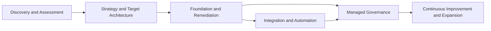

# Service Architecture

## Service portfolio model

## Service families

### 1. Fractional technology leadership

Outcomes:

- Clear strategy and investment sequence
- Executive decision support
- Vendor and platform governance
- Risk and security prioritization
- Technology roadmap and budget

### 2. Secure workplace foundation

Outcomes:

- Governed identity
- Managed endpoints
- Secure collaboration
- Documented administration
- Supportable operational baseline

Working components:

- Tenant setup or takeover
- Licensing alignment
- MFA and Conditional Access
- Privileged access
- Device enrollment and management
- Endpoint security
- Collaboration and sharing governance
- Documentation and handoff
- Backup strategy definition and basic implementation
- SaaS app access review and control
- Logging and incident-readiness baseline

Pricing model:

- Foundation Core: approximately $6,000–$9,000 for 1–9 user environments
- Foundation (Full): approximately $12,000–$18,000 for a clean greenfield implementation
- Foundation (Complex): $18,000+ when legacy conditions, migration risk, or higher regulatory burden apply

Working effort model for a clean greenfield tenant:

- approximately 46 execution hours for a complete foundation implementation

### 3. Cloud and virtual workspace

Outcomes:

- Secure remote access
- Standardized hosted desktops or cloud PCs
- Controlled application access
- Supportable profile, storage, and connectivity architecture

### 4. Security and compliance readiness

Outcomes:

- Reduced configuration risk
- Measurable posture improvement
- Documented controls and evidence
- Remediation program
- Ongoing control maintenance

Formal attestations remain with qualified independent professionals.

### 5. Integration and automation

Outcomes:

- Reduced manual effort
- Fewer handoff errors
- Connected systems
- Better visibility
- Faster cycle time
- Auditable workflows

The company may use APIs, native connectors, workflows, scripts, lightweight applications, data synchronization, analytics, RPA, and desktop automation.

### 6. Managed governance

Outcomes:

- Continuing ownership
- Configuration and policy maintenance
- Security review
- Documentation currency
- Vendor coordination
- Roadmap management
- Automation monitoring
- Escalation and selective support

## Productization standard

Every service must define:

- Ideal customer
- Trigger event
- Business outcome
- Scope
- Exclusions
- Dependencies
- Delivery stages
- Customer responsibilities
- Evidence and acceptance
- Risks
- Pricing logic
- Recurring attach
- Expansion path
- Required skills and partners

Use `templates/SERVICE-BRIEF.md`.
