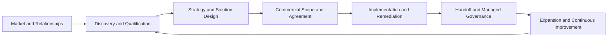

# Operating Model

## Purpose

Translate the established business design into a practical company operating system.

## Core flow

## Functional ownership

### Sales and relationships

Primary accountabilities:

- Target-account development
- Relationship management
- Discovery coordination
- Opportunity qualification
- Commercial feedback
- Proposal progression
- Account expansion

### Technology, security, and strategy

Primary accountabilities:

- Service portfolio
- Technical standards
- Security architecture
- Target-state design
- Solution quality
- Partner and distributor technology relationships
- Complex escalation
- Innovation and reusable patterns

### Operations and delivery

Primary accountabilities:

- Project planning
- Resource coordination
- Delivery execution
- Service operations
- Quality assurance
- Documentation completion
- Change control
- Escalation coordination
- Capacity and delivery economics

## Operating cadences

### Weekly pipeline and delivery review

Review:

- New opportunities
- Qualification status
- Proposals
- Delivery health
- Risks and escalations
- Capacity
- Customer decisions needed
- Receivables and commercial blockers

### Monthly operating review

Review:

- Revenue and gross margin
- Pipeline and conversion
- Project performance
- Recurring revenue
- Customer health
- Security and operational incidents
- Partner performance
- Service-quality metrics
- Priorities for the next month

### Quarterly strategy review

Review:

- Market evidence
- Service performance
- Pricing
- Partner strategy
- Technology roadmap
- Hiring and contributor capacity
- Risk posture
- Financial forecast
- Major decisions and experiments

## Decision model

Day-to-day decisions should be made by the accountable function. Material decisions require founder approval and a decision record.

Material decisions include:

- Ownership and governance
- Legal or tax structure
- Company name
- Service launch or retirement
- Pricing-model changes
- Major partner or distributor commitments
- Significant hiring or capital commitments
- Security exceptions with material risk
- Entry into a new market or geography

## Contributor model

The initial company should remain founder-led and use qualified specialists or contractors where needed rather than hiring a broad permanent team before revenue supports it.

Contributor engagement must define:

- Scope and expected outcomes
- Customer access
- Confidentiality and intellectual property
- Security requirements
- Quality and acceptance
- Commercial terms
- Escalation and replacement
- Knowledge transfer

## Service portfolio governance

Every service must have:

- A service owner
- Defined customer and trigger
- Scope and exclusions
- Standard delivery stages
- Required roles and partners
- Cost and pricing logic
- Acceptance evidence
- Recurring attach
- Metrics
- Revision history

## Quality principles

- Strategy precedes tooling.
- No implementation is complete without documentation and ownership.
- Standard configurations are preferred over one-off customization.
- Exceptions require explicit risk acceptance.
- Customer access is named, least-privileged, and auditable.
- Reusable lessons are captured after every engagement.
- Senior review is required for architecture, security, and high-risk changes.
